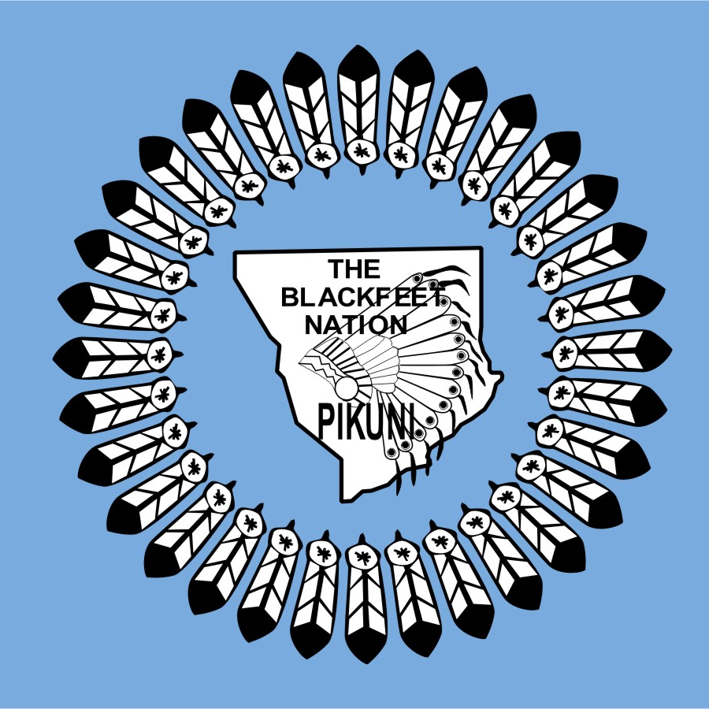
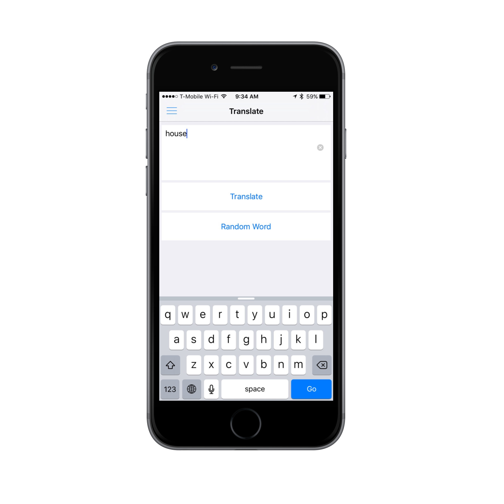
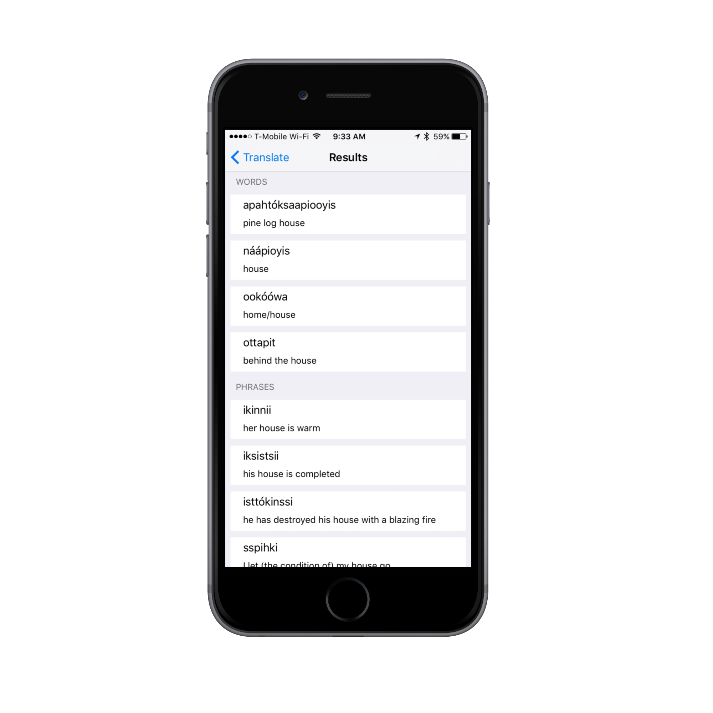
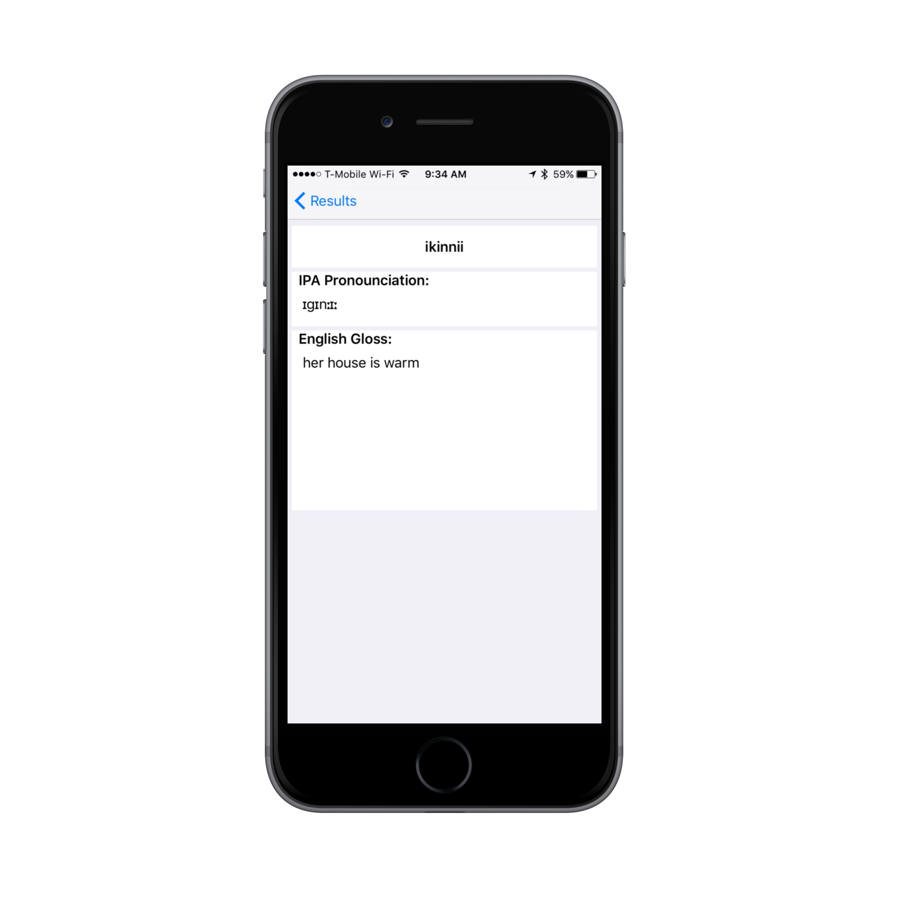

</img>
##Blackfoot Dictionary

Blackfoot Dictionary is an iOS translator and dictionary for the Blackfoot language.  
It is written in Swift and compatible with iOS 8.0 and greater.

**Note**: Dictionary data is courtesy of [Don Frantz](http://people.uleth.ca/~frantz/) at the University of Lethbridge

----

Translate English to Blackfoot or look at a random word
</img>

View translation results broken into words and phrases
</img>

Take a detailed look at each result with machine-generated IPA pronounciations
</img>

----

##License

See the [LICENSE](LICENSE.md) file for license rights and limitations (MIT)